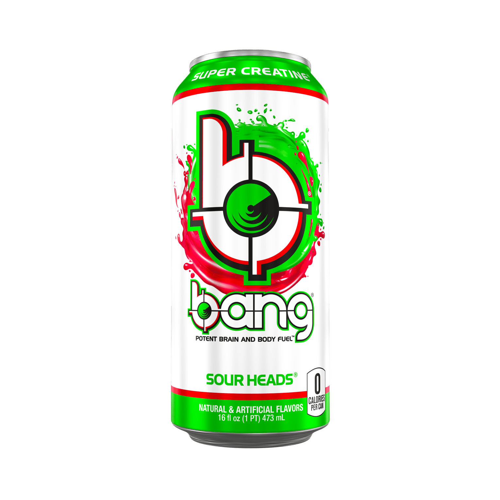

# Bang Sour Heads
Score: **4.5 / 10**

{ width="300" align="right" }

Today I am reviewing the Bang Sour Heads energy drink. Bang is of course one of the stronger energy drinks out there at a whopping 300 mg of caffeine per can. I (try to) stay away from these drinks unless I feel like I really need it for whatever reason, lack of sleep, etc.

I came in not sure if I would like this drink as I'm usually not a fan of sour drinks. I prefer the candy flavored drinks like C4 Skittles / Starburst or Bang's Cotton Candy. I was pleasantly surprised by the taste upon the first sip as I didn't find the sour taste overwhelming. It did have a strong fizz and taste which took some getting used to. The best comparison I can make for describing the sour-ness is probably to Sour Skittles.

One unfortunate thing I found is that the sour taste and the flavor of the can went away very quickly. The first quarter of the can had a strong flavor to it but after making my way through the can, the taste almost completely went away. The rest of the can tasted unfortunately very close to lemon water. This was disappointing as other Bang drinks I have tried have not suffered from this problem. For this, I am knocking off several points off my review.

The 300mg of caffeine in the can redeems it somewhat and despite the taste wearing off, the energy boost off the can was insane. Felt absolutely wired for a morning workout and so far has not dropped off. However, in the future I would prefer and recommend Bang's Cotton Candy as opposed to this Bang Sour Heads drink.
