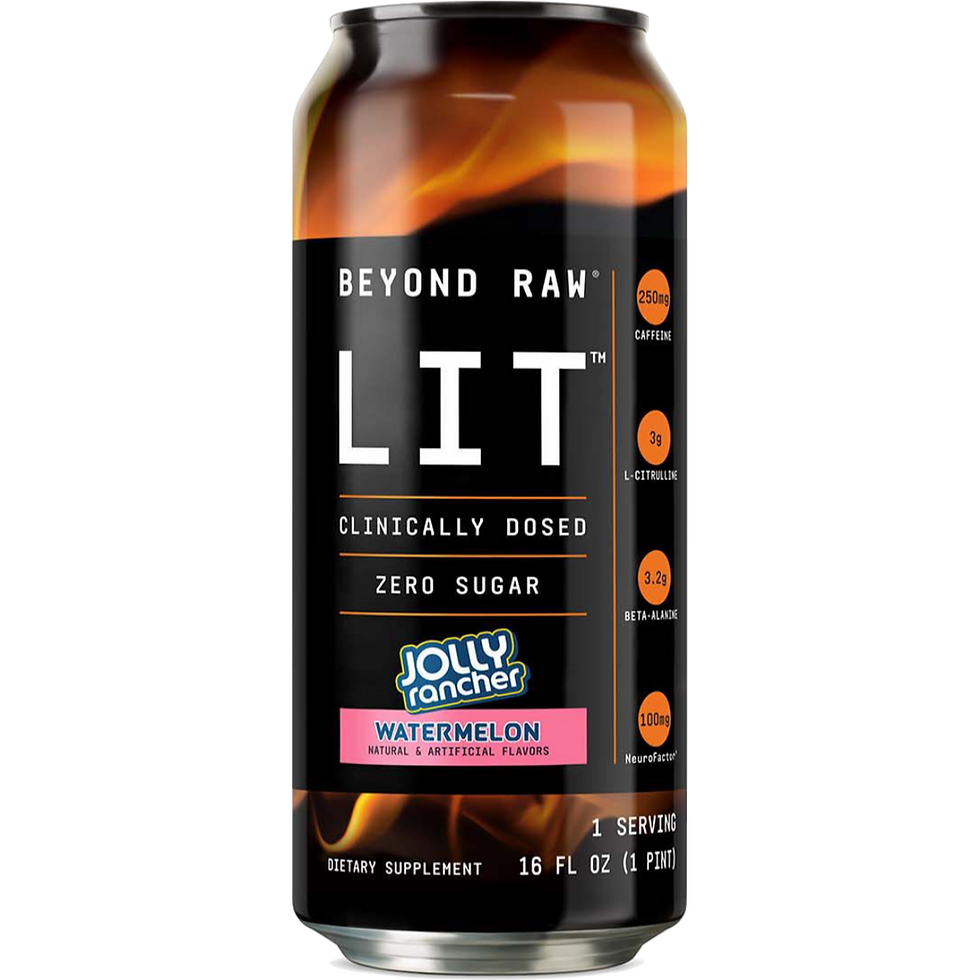

# Beyond Raw Lit Jolly Rancher Blue Raspberry
Score: **8.1 / 10**

{ width="300" align="right" }

Welcome back loyal fans. I'm glad to announce I have returned after a long hiatus. This morning I tested Beyond Raw Lit's Jolly Rancher Blue Rasberry energy drink. Back when I used to take preworkout, I loved Beyond Raw Lit's different preworkouts. Beyond Lit Raw always packed a bunch of beta alanine in their preworkouts and that stuff makes it feel like there's ants crawling all over your face. Which feels awesome.

Their energy drinks are in a similar vein. Beyond Lit Raw Jolly Rancher Blue Rasberry has 250 mg of caffeine which is pretty high but not at Bang and Reign levels which go to 300 mg. However despite not having as much caffeine, Beyond Raw Lit contains much more beta alanine which adds to the experience. That's why, in my humble opinion, despite not having as much caffeine as the big boys of Bang and Reign, Beyond Raw Lit provides a stronger kick.

The taste is also of decent quality as well. I don't think it tastes exactly like a blue Jolly Rancher, however it does resemble it. You can definitely tell what they were trying to go for. It does have a nice sweetness to it that doesn't fade away after you reach the end of the can. Overall, I think it's an excellent drink choice that I would recommend before a workout of some kind, not for anything that requires sitting still. 

It is one of the pricier options out there, as I procured this can at GNC for 3 dollars. That being said, I think it's an overall very high quality drink that has a good taste. 8.1 / 10