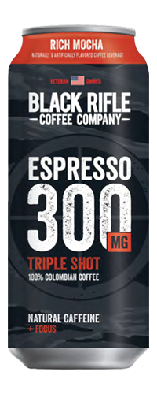

# Black Rifle Rich Mocha Coffee
Score: **9.6 / 10**

{ width="150" align="right" }

This week's review is a special July 4th edition (a little late, I know). Today I am reviewing Black Rifle's Rich Mocha Coffee. Black Rifle's branding is absolutely on point with a giant american flag on the can along with a slogan of *"serving coffee and culture to people who love America"* and a warning of *"300 mg of freedom fuel"*. Excellent stuff.

It's worth noting that some energy drink traditionalists argue that coffee based drinks should not count as energy drinks and I have mixed feelings on this topic. Perhaps a discussion for another time.

As I patriotically sipped my Black Rifle Coffee, my first thought was that it was absolutely delicious. I'm not usually a coffee person but this coffee has a wonderful creaminess and flavor to it. The *"Rich Mocha"* label did not disappoint and the taste was exactly such. For coffee lovers who are not big energy drink fans I think that this can be a great gateway into the energy drink world.

I found the energy hit of this can to be absolutely insane. Downed the drink with no breakfast first thing on a Sunday morning, and felt like my head was going to explode. Whatever is in this *"freedom fuel"* is some powerful stuff. Highly recommend this drink, Black Rifle Coffee has become one of my absolute favorites.
