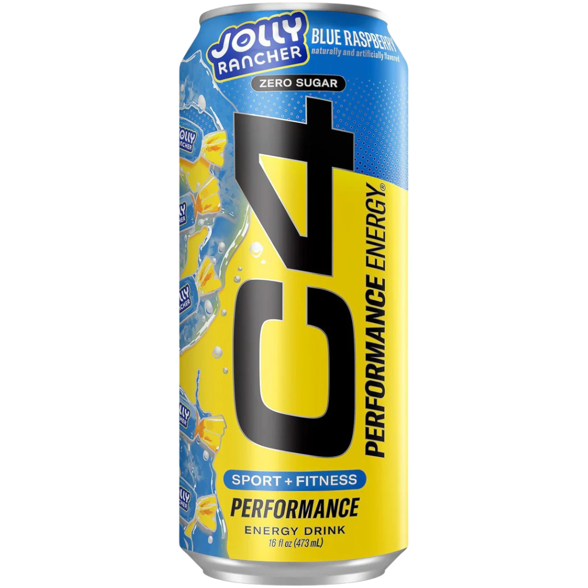

# C4 Jolly Rancher
Score: **7.4 / 10**

{ width="300" align="right" }

Welcome back energy drink fans, I'm glad to say I have returned after a long hiatus to drop a review. This week, I'm reviewing the C4 Jolly Rancher drink. This edition was just recently released by C4 just earlier this year in August. C4 seems to be poised to take over the energy drink X candy collab market. C4 has existing partnerships/flavors with their Starburst edition, Skittles edition, and Popsicle edition drink and now adds Jolly Rancher to the mix.

It's worth noting that C4 isn't the only energy drink brand that collabs with Jolly Rancher, Beyond Raw Lit also has drinks with Jolly Rancher. I've previously reviewed one of these drinks (Beyond Raw Lit Rancher Blue Raspberry) from Beyond Raw and have had a very favorable opinion of it (8.1 / 10) This Jolly Rancher drink by C4 goes for the green Jolly Rancher taste unlike the Beyond Raw Lit one which goes for the blue one.

I thought that as far as matching the drink taste to the actual candy, C4 does a pretty good job with this one. It tastes very close to how I remember green Jolly Ranchers tasting. That being said I didn't like it as much as I liked Beyond Raw Lit's Jolly Rancher drink. However, that could be because I like blue Jolly Ranchers over the green ones.

Still, taste wise it was still quite good and it hit the spot. This drink's caffeine content comes in at around 200 mgs. It packs a decent kick especially since I've been having less caffeine as of late and it is definitely a great way to start a morning. Overall I'm reasonably happy with this drink and I would give it a 7.4 rating out of 10.
