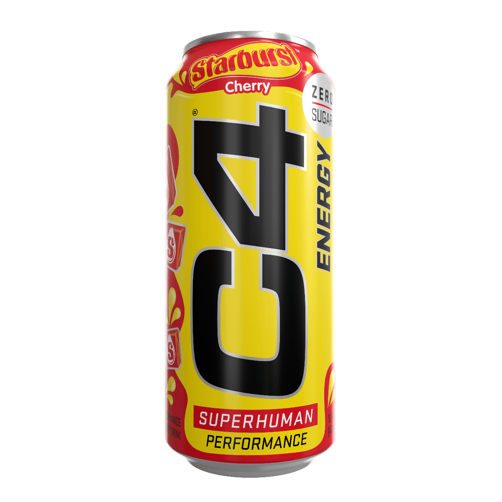

# C4 Starburst
Score: **8.2 / 10**

{ width="280" align="right" }

Hello all, I know it's been a while since I dropped my last review. Between travel and life stuff I just haven't had the time to write. I'm excited to come back hot with this review of C4's Starburst flavored energy drink.

I remember brands like C4 and Ghost more so for their pre-workout and it's interesting seeing them expand in the energy drink market. Despite being newcomers to the energy drink game with existing major players (Red Bull, Monster, etc) I feel like C4 and Ghost have been much more innovative in terms of flavors. C4 in particular has been great with flavors, my favorites being Starburst and Skittles flavored (skittles review coming later) drinks.

The C4 Starburst drink tastes absolutely delicious. For those who like Starburst, I think C4 did a very good job in matching the taste of the pink starburst candy. The taste is sweet but not overpowering. There's no foul aftertaste and it goes down very smoothly. I'm also increasing the score because of the energy kick the drink gives. C4 drinks don't go crazy on the caffeine, this can only has 200mg, but their drinks still hit pretty good even if you're a caffeine junkie. I'm guessing it's because of the beta alanine they add, I'd be curious to see if they add a lot more beta alanine than other brands (although I don't feel like researching this at the moment). I definitely feel the facial tingles after half a can of the C4 Starburst and it's a great way to start off your day. Excellentexperience - 8.2 / 10.
