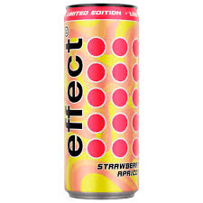

# Effect Strawberry Apricot
Score: **8.1 / 10**

{ width="300" align="right" }

  Hello loyal readers after a long hiatus! I have returned to drop a review of a drink from a German energy drink brand - Effect. I tried to do some research on which brands are the most popular in Germany, but wasn’t able to find any good statistics on this. Anecdotally, it does seem that looking around in German supermarkets that Red Bull, Rockstar, and Monster seem like the most popular brands in that order. After the big three powerhouses, Effect seems to be the most popular local drink stocking the shelves in the local Aldis, Lidls, and Rewes. 
&nbsp;
&nbsp;
	The can has a fairly simple design with a bunch of red dots on it. I found this to be a little disappointing compared to the beautiful can designs of Monster. The drink is fairly light on the caffeine, coming in at 105 mg. Previously, I would have found this a drawback - however lately I have been trying to cut back on my caffeine intake and found this to be a nice range to be in. Effect offers a selection of drinks including a base flavor along with other flavors such as Black Acai, Bubble Gum, Guava Massive, Grape Mint, Strawberry Apricot, and Coconut Blueberry. The drink I tasted today is the Strawberry Apricot.
 &nbsp;
&nbsp;
	I was pleasantly surprised by the refreshing taste of this drink. I don’t like the fruits of strawberries or apricots that much, however the flavor of this strawberry apricot drink was simply delicious. It went down so smoothly and I just wanted to chug the rest of the can after each sip. It had a light fruity texture and didn’t have any unpleasant artificial taste to it. Of all the various energy drinks I have tried, this one is certainly one of the best tasting ones.
 &nbsp;
&nbsp;
	For those who are used to higher caffeine intakes, I would not recommend this can as a daily driver since it doesn’t pack anywhere near the kick of a Bang or a Reign. However, for those used to coffee or trying to cut back on their caffeine, this drink is a great option and it tastes very good.
&nbsp;
&nbsp;
Ratings
Can Design - 2 / 10
Price - 5 / 10
Taste - 10 / 10
Energy Kick  - 2 / 10
Overall - 8.1 / 10
