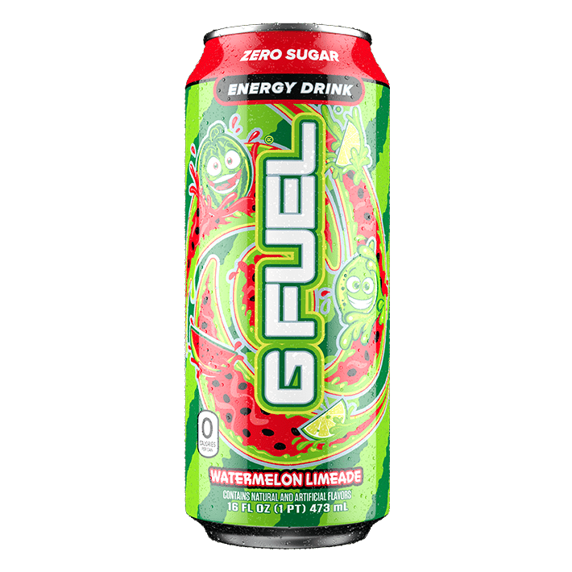

# G Fuel Watermelon Limeade
Score: **5.2 / 10**

{ width="300" align="right" }

Good evening everyone. Today I am reviewing the G Fuel Watermelon Limeade energy drink. This drink was specifically requested by a reader of this site for review. Lately I have been consuming less caffeine than usual (around 200 mg a day), so I was excited to try the can of G Fuel Watermelon Limeade coming in at a whopping 300 mg of caffeine. G Fuel is a brand that I do not try very often - when I was consuming energy drinks around this caffeine range, I would normally choose the drinks by Reign or Bang. However, I have previously tried G Fuel's Cherry Lollipop Pacman drink (unreviewed) and thought it was quite good.

When I started drinking this can of G Fuel Watermelon Limeade, my initial thoughts were the flavor was relatively bland. It was not unpleasant, in fact I do enjoy a nice watermelon flavor. However I couldn't really taste much and I had to focus to get the hints of watermelon and limeade in this drink. I thought this was quite odd since normally energy drink flavors are much more pronounced. That was the biggest disappointment to me, since I was expecting a little bit more from this drink.

Despite the lack of a strong taste, the energy boost coming from the can was quite impressive. I could feel my legs shaking once I got a third of the way through the can. For where my caffeine tolerance was at the moment I would say the energy kick wasn't ideal for sitting down and doing office work - since the energy kick was a bit stronger than ideal. However, for a workout or any kind of physical activity I would recommend this can for that (although there are certainly ones with a similar punch that provide a better taste in my opinion). The energy crash in the afternoon from the drink was quite strong as well and I definitely had to go through a bit of a slump.

My overall thoughts is that this energy drink certainly has its utility for certain situations but I think there are just better tasting cans out there that provide a similar punch. I would not recommend to my readers to buy this can as a daily driver.
