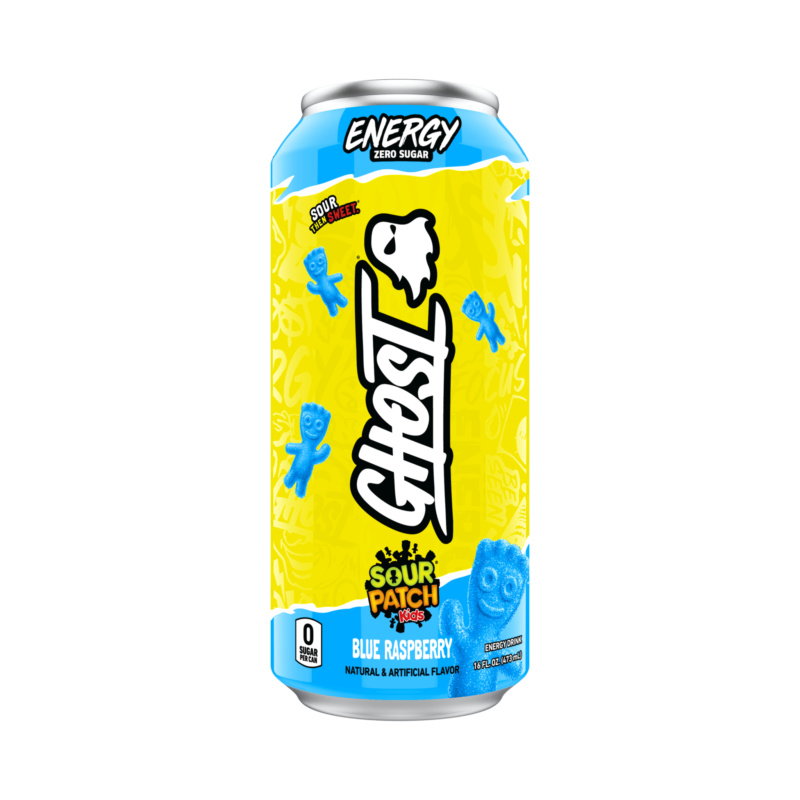

# Ghost Sour Patch Blue Raspberry
Score: **2.9 / 10**

{ width="300" align="right" }

This Sunday morning, I taste tested the Ghost Sour Patch Blue Raspberry energy drink. I came in with high expectations since other flavors of Ghost I've tried (orange cream and faze pop) have been absolutely delicious. Ghost generally has a good kick to it despite a modest 200 mg of caffeine.

However, with Ghost Sour Patch Blue Rasberry I was severely disappointed. I am generally a fan of candy flavored drinks (C4 Starburst and C4 Skittles especially) but the sour patch flavor did not agree with me. I do like the actual sour patch candy but to me this drink did not accurately reflect the flavor of Sour Patch. I also like the taste of raspberries, they are one of only two fruits I actually like, the other being blueberries. Ghost Sour Patch Blue Rasberry was a poor reflection of both flavors they were trying to imitate. The combination of these two flavors did not mix well together.

The only redeeming factor of this drink is the solid energy kick it gave. The beta alanine in Ghost drinks does a good job of making it feel like your face is being constantly pricked by the time you're halfway through the can. Despite that, Ghost has missed the mark with this flavor and I am giving this drink a 2.9 out of 10.