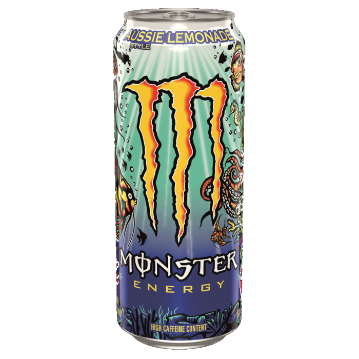

# Monster Aussie Lemonade
Score: **1.8 / 10**

{ width="300" align="right" }

Good morning everyone. Today I am reviewing the Monster Aussie Lemonade energy drink. This drink was specifically requested from a fan's recommendation - so I stopped by a WaWa's and found this drink to review. Researching this drink on Monster's website, their description of this drink is as follows - *"Inspired by the land down under and powered by our world-famous Monster Energy blend, Aussie Style Lemonade is a carbonated exotic twist on lemonade. Tart yet sweet, with a burst of fresh citrus flavor."* Interestingly, I also discovered that this flavor of Monster will be discontinued soon and will be going away sometime in 2025.

Looking at the can, I think this is one of the most eye popping designs I have ever seen. There are a number of sea creatures with a bright blue background that are fun to look at. Looking at the can's nutrition label - I noticed this can has 46 grams of sugar. I usually review and drink sugar free energy drinks (with the rare exception of Rockstar Fruit Punch) so I thought this would be an interesting one to review.

When I took my first sip of this can, I was absolutely horrified. I thought the flavor was extremely unpleasant. The combination of the lemonade flavoring which was a little sour combined with the sugar in the drink did not go well together. The first initial taste I got from each sip was a sour kick and then followed up by the sweet aftertaste. Unfortunately, I was not able to finish this drink as I did not enjoy it. I understand why it is being discontinued. For these reasons, I am giving this drink a score of 1.8 out of 10.
