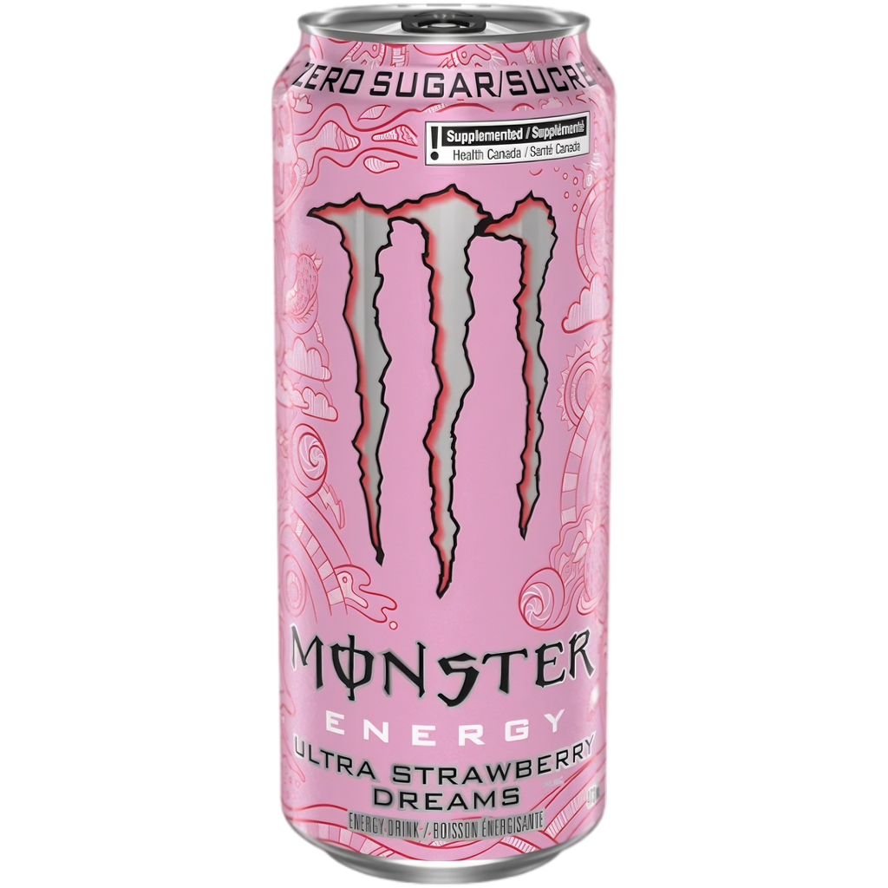

# Monster Ultra Strawberry Dreams
Score: **7.8 / 10**

{ width="280" align="right" }

When walking down the self checkout lines at Target, the Monster Ultra Strawberry Dream energy drink can caught my eye. It was a bright pink can with an aesthetically pleasing design. My fish brain was instantly attracted to it and between that and the pressure of my many fans (all three of them) clamoring for a new review, I knew I had to buy it.

When I first took a sip, I was... pleasantly surprised. If the fans read my last review on the Celsius Strawberry lemonade, they'll know that I'm not the biggest fan of strawberry flavored things. Despite that, I thought the taste of Monster Ultra Strawberry Dreams was pretty damn good. The light strawberry kick left a pleasant taste in my mouth and I wanted to down the rest of it immediately.

I will say I enjoyed this flavor of Monster better than most of the other flavors of theirs I tried and this is a can that I would get again. The main drawback for me is the lack of kick to it. This can contains a mere 110mg of caffeine per can..slightly more than a cup of coffee. If you have a serious caffeine addiction like me, that is just not going to cut it. That's why I'm docking a few points off the score.

That being said, overall this is an excellent drink. The can was aesthetically pleasing (which does factor into my review in case anyone is
wondering) and the taste was pretty good. 7.8 out of 10 for me, would buy again.
