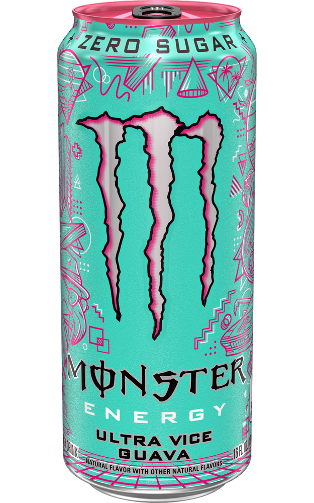

# Monster Ultra Vice Guava
Score: **7.0 / 10**

{ width="200" align="right" }

Good morning everyone. In this edition of energy drink reviews, I am responding to a fan request to review the recently released Monster Ultra Vice Guava energy drink. This is the newest drink in Monster's Ultra Line and only recently was put in stores several months ago. Monster now has quite a few drinks in their *"Ultra"* line, which offers a lighter tasting sugar-free version than the regular Monster. I have previously reviewed the Monster Ultra Strawberry Dreams and remain a big fan of that drink.

Moving on to the Ultra Vice Guava, the can design (see picture) is eye popping and quite aesthetically pleasing. The caffeine content of this drink comes in at 150 mgs. In my personal opinion, the energy boost off Monsters takes longer to kick in than other energy drinks- possibly because of the can's large size which takes longer to consume.

The taste was quite interesting. I thought the first few initial sips of the can were quite harsh and tasted a little off. But after these first few sips, the taste was a smooth guava flavor that was quite pleasant. I do not normally like guava flavor, but this drink made me reconsider that notion. Overall I would say I had a very enjoyable experience sipping this can. I would recommend this drink for a lazy weekend morning because of the longer time needed for the energy hit. For more strenuous activity I would start looking in the 200 mg+ caffeine range (Ghost, Celsius, C4, Alani, etc). Overall score - 7.0 / 10.