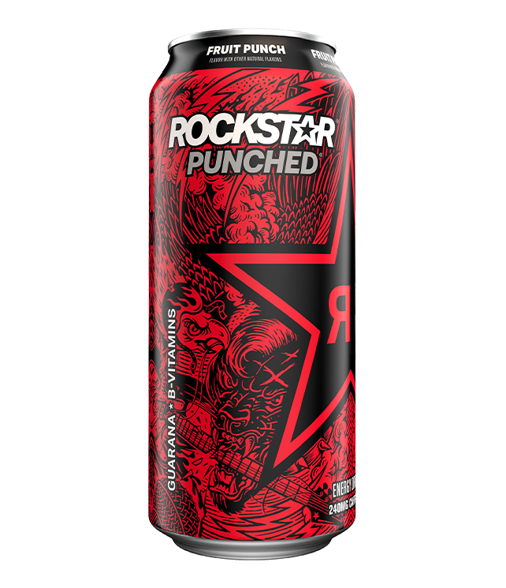

# Rockstar Fruit Punch
Score: **7.5 / 10**

{ width="300" align="right" }

This morning I tested the Rockstar Fruit Punch Zero energy drink. This is a drink that I've had a number of times before and is one of my go-tos. Rockstar is one of those brands that goes for cheaper than the other big brands like Red Bull and Monster which is why I primarily roll with Rockstar for my daily drink. Of all the Rockstar flavors, I personally love Grape the best, then Silver Ice and Fruit Punch next.

Taste wise, Rockstar Fruit Punch is quite good. You're getting exactly what the can is advertising. To me, it tastes pretty much exactly like fruit punch. If you like fruit punch, you will like this drink. Not much else to say about it. One caveat to add is that this review if for the zero sugar one, I have tasted the Rockstar Fruit Punch with sugar and I do think the sugared one is a little bit better.

Caffeine content in this one definitely packs a punch at 240 mg of caffeine. More than Celsis / Ghost (200 mg) and less than Reign / Bang (300 mg) so it's a good middle ground there. Enough to get you going for the day but enough to have you bouncing off the walls. Overall, pretty solid drink and a decent option for a daily go-to. Giving this one a 7.5 / 10.