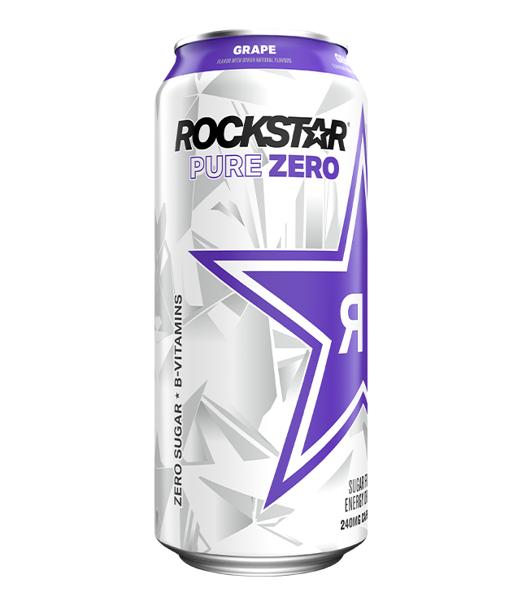

# Rockstar Grape Zero Sugar
Score: **7.8 / 10**

{ width="250" align="right" }

Rockstar Grape Zero is... pretty damn good. If you like grape flavored things, you're gonna love this one. Rockstar is one of those drinks in my opinion that always flies under the radar below Monster and Red Bull. Which is strange to me since Rockstar usually goes for a buck or sometimes two depending on where you live.

This drink definitely packs a solid punch at 240 mgs of caffeine. Definitely a solid go-to on days where I haven't had enough sleep. The odd thing though is despite having more caffeine than drinks like C4, it doesn't pack as hard a punch as C4. But still... definitely strong enough of a kick to get you going in the morning.

Taste itself will be hit or miss depending on if you like grape flavored stuff. I'm definitely a huge fan of grape flavored things, so I really like this one. There is definitely a bit of an artificial taste there but it doesn't bother me. I'm giving this drink a 7.8 / 10.